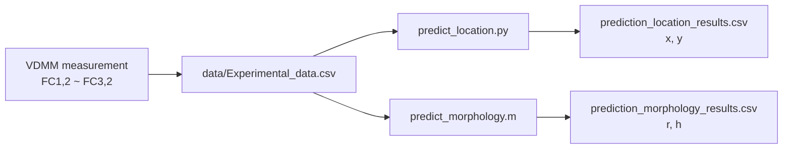

# VDMM: Physics-informed machine learning for mapping pitting corrosion

---

**Author:** Tao Jiang @ China University of Petroleum (East China)

**Project Goal:** Invert the location `(x, y)` and morphology parameters `r` (pit radius) and `h` (pit depth) of pits in the specimen under test from FC signal features measured by VDMM technology.

---

## Overview

This code package implements the machine learning inversion workflow described in the manuscript *"Physics-informed machine learning for mapping pitting corrosion"*. Given a set of FC feature values measured experimentally, **two independent models** perform the following tasks:


| Task                     | Output   | Language | Algorithm                                                           |
| ------------------------ | -------- | -------- | ------------------------------------------------------------------- |
| **Location inversion**   | `x`, `y` | Python   | Gradient boosting regression + Bayesian hyperparameter optimization |
| **Morphology inversion** | `r`, `h` | MATLAB   | Neural network + genetic algorithm weight initialization            |


Both models share the same experimental input file `data/Experimental_data.csv`, but use different feature engineering and training strategies, corresponding to the location mapping and morphology inversion sections in the manuscript.

### Workflow




---

## Directory Structure

**Run all scripts from the project root directory.**

```
VDMM-Pits-Mapping/
├── README.md                              # User guide
├── requirements.txt                       # Python dependencies
├── train_model_location.py                # Pit location model training
├── predict_location.py                    # Pit location prediction
├── train_model_morphology.m               # Pit morphology model training
├── predict_morphology.m                   # Pit morphology prediction
├── data/
│   ├── Location_data.csv                  # Location training labels
│   ├── Morphology_data.csv                # Morphology training labels
│   └── Experimental_data.csv              # Experimental inference examples
```

---

## Requirements

### Location Model (Python)

- Python 3.8+
- Dependencies listed in `requirements.txt`:

```bash
pip install -r requirements.txt
```


| Package         | Version        |
| --------------- | -------------- |
| numpy           | >= 1.23, < 2.0 |
| pandas          | >= 1.5         |
| scikit-learn    | >= 1.2         |
| scikit-optimize | >= 0.9         |
| matplotlib      | >= 3.6         |
| joblib          | >= 1.2         |


### Morphology Model (MATLAB)

- MATLAB R2019b or later
- Deep Learning Toolbox (requires support for `fitnet`, `train`, `mapminmax`)

### Tested Environment


| Item | Configuration      |
| ---- | ------------------ |
| OS   | Windows 10/11      |
| CPU  | Intel Core Ultra 5 |
| RAM  | 32 GB              |
| GPU  | Not required       |


---

## Data Description

### Shared Inference Input `data/Experimental_data.csv`

Used by both location and morphology prediction. Contains 5 experimental specimens:


| Column  | Description    |
| ------- | -------------- |
| `No.`   | Sample ID      |
| `FC1,2` | Raw FC feature |
| `FC2,1` | Raw FC feature |
| `FC2,2` | Raw FC feature |
| `FC2,3` | Raw FC feature |
| `FC3,2` | Raw FC feature |


### Location Training Data `data/Location_data.csv`

442 samples in total.


| Column            | Description                          |
| ----------------- | ------------------------------------ |
| `x`, `y`          | Pit coordinates (prediction targets) |
| `FC1,2` ~ `FC3,2` | Raw FC features                      |


### Morphology Training Data `data/Morphology_data.csv`

2201 samples in total.


| Column                             | Description                               |
| ---------------------------------- | ----------------------------------------- |
| `r`, `h`                           | Pit radius and depth (prediction targets) |
| `FC1,2`, `FC2,1`, `FC2,2`, `FCsum` | Precomputed input features                |


---

## Feature Engineering

The two models construct physics-informed features from raw FC values in different ways:

### Location Model: Ratio Features

Both training and inference convert raw FC values into 4 ratio features:

- `FC2,1 / FC2,2`
- `FC2,3 / FC2,2`
- `FC1,2 / FC2,2`
- `FC3,2 / FC2,2`

### Morphology Model: Physics-Corrected Features

During inference, features consistent with training are constructed from `FC2,1`, `FC2,2`, and `FC2,3` via correction formulas:

- `FCsum = FC2,1 + FC2,2 + FC2,3`
- `FC1,2C = k1 × FCsum / (1 + k3 + k4)`
- `FC2,1C = k3 × FCsum / (1 + k3 + k4)`
- `FC2,2C = FCsum / (1 + k3 + k4)`

Correction coefficients: `k1 = 0.23`, `k3 = -0.32`, `k4 = -0.32`.

---

## Usage

**Working directory:** Set the terminal or MATLAB current path to the project root `VDMM-Pits-Mapping/`. All scripts read from the `data/` folder by default and write models and results to the root directory.

**First-time use:** The repository initially contains only training scripts and data, without pre-trained models. Complete Steps 1 and 2 (training) before Steps 3 and 4 (prediction).

### Step 1: Train the Location Model

```bash
python train_model_location.py
```

**Main workflow:**

1. Read `data/Location_data.csv` and construct ratio features
2. Split into training and test sets (80%/20%, `random_state=10`)
3. Bayesian search for hyperparameter optimization (`n_iter=50`, 5-fold cross-validation, scoring metric R²)
4. Report MSE, RMSE, MAE, R², and residual statistics on the test set
5. Save the model and evaluation plots

**Main outputs:**


| File                                | Description                                    |
| ----------------------------------- | ---------------------------------------------- |
| `gradient_boosting_model.joblib`    | StandardScaler + MultiOutputRegressor Pipeline |
| `gradient_boosting_features.joblib` | Names of 4 feature columns                     |
| `gradient_boosting_targets.joblib`  | Target column names `x`, `y`                   |
| `actual_vs_predicted_location.png`  | Actual vs. predicted scatter plots for x and y |


**Typical runtime:** < 90 s

### Step 2: Train the Morphology Model

Set the current directory to the project root in MATLAB, then run:

```matlab
train_model_morphology
```

**Main workflow:**

1. Read `data/Morphology_data.csv`, extract 4-dimensional input features and `r`, `h` targets
2. Randomly split into training and test sets (80%/20%, `rng(42)`)
3. Normalize inputs and outputs to [-1, 1] using `mapminmax`
4. Genetic algorithm search for neural network initial weights
5. Report RMSE and R²; save the model and test-set actual-vs-predicted scatter plots

**Main outputs:**


| File                                 | Description                                                                                   |
| ------------------------------------ | --------------------------------------------------------------------------------------------- |
| `net_rh.mat`                         | Contains `net_rh` (network), `X_ps`/`Y_ps` (normalization parameters), and evaluation metrics |
| `actual_vs_predicted_morphology.png` | Actual vs. predicted scatter plots for r and h                                                |


**Typical runtime:** 10–15 min

### Step 3: Location Prediction

```bash
python predict_location.py
```

1. Load the trained location model
2. Read `data/Experimental_data.csv`
3. Construct ratio features and run inference
4. Output `prediction_location_results.csv` (predicted `x`, `y`)

**Typical runtime:** < 2 s

**Custom input/output:** Modify the `input_file` or `output_file` variable in `predict_location.py`. The input CSV must contain the five columns `FC1,2`, `FC2,1`, `FC2,2`, `FC2,3`, and `FC3,2`.

### Step 4: Morphology Prediction

```matlab
predict_morphology
```

1. Load `net_rh.mat`
2. Read `data/Experimental_data.csv`
3. Construct 4-dimensional input features from `FC2,1`, `FC2,2`, and `FC2,3` via physics correction formulas
4. Run neural network inference and denormalize outputs
5. Output `prediction_morphology_results.csv` (predicted `r`, `h`)

**Typical runtime:** < 5 s

**Custom input/output:** Modify the `predict_filename` or `output_filename` variable in `predict_morphology.m`. The input CSV must contain `No.` (or sample IDs in the first column) and the three columns `FC2,1`, `FC2,2`, and `FC2,3`.

---

## Reproducibility

- **Location model:** With the same Python version and dependencies, the random seeds above should make the train/test split and Bayesian search reproducible. Differences in scikit-learn or scikit-optimize versions may cause slight variations in optimal hyperparameters and metrics.
- **Morphology model:** With the same MATLAB version and toolbox, `rng(42)` should make the data split reproducible. Genetic algorithm and neural network training involve floating-point operations; optimal weights and final metrics may vary slightly across hardware or MATLAB versions.

---

## Citation

This repository is associated with the manuscript:

> **"Physics-informed machine learning for mapping pitting corrosion"**
> Tao Jiang et al., China University of Petroleum (East China), 2026.
> *(Currently under review)*

---

## License

This project is licensed under the MIT License.
